# Final Assignment — Data Pipeline (Full Docker Setup)

A comprehensive data pipeline for collecting, processing, and serving supermarket pricing data with automatic database updates.

## Architecture Overview

```mermaid
---
config:
  layout: dagre
---
flowchart LR
    C["<b>Crawler</b><br>Service Web Scraping<br>Downloads Price &amp; Promo Files"] -- <br> --> MINIO["<b>MinIO Storage</b><br>S3 Compatible<br><br>"]
    MINIO -- <br> --> E["<b>Extractor Service<br></b>XML Processing<br>Data Transformation"]
    E -- <br> --> RMQ["<b>RabbitMQ</b><br>Message Queue<br>Reliable Processing"] & MONGO["<b>MongoDB</b><br>State Management<br>Processing Status"]
    RMQ -- <br> --> EN["<b>Enricher Service</b><br>AI Enrichment<br>Data Enhancement"]
    EN -- <br> --> PG["<b>PostgreSQL</b><br>Primary Database<br>Enriched Data"]
    PG -- <br> --> API["FastAPI Service<br>REST API<br>Swagger Documentation"]
    API --> USERS["Users &amp; Applications<br>API Consumers<br>Data Access"]
    C@{ shape: rounded}
    MINIO@{ shape: cyl}
    E@{ shape: rounded}
    RMQ@{ shape: rounded}
    MONGO@{ shape: cyl}
    EN@{ shape: rounded}
    PG@{ shape: cyl}
     C:::processing
     MINIO:::storage
     E:::processing
     RMQ:::storage
     RMQ:::Sky
     RMQ:::processing
     MONGO:::storage
     EN:::processing
     PG:::storage
     API:::access
     USERS:::access
    classDef external fill:#e8f5e8,stroke:#2e7d32,stroke-width:3px,color:#000
    classDef storage fill:#f3e5f5,stroke:#7b1fa2,stroke-width:3px,color:#000
    classDef access fill:#fff3e0,stroke:#ef6c00,stroke-width:3px,color:#000
    classDef Sky stroke-width:1px, stroke-dasharray:none, stroke:#374D7C, fill:#E2EBFF, color:#374D7C
    classDef processing fill:#e3f2fd, stroke:#1565c0, stroke-width:3px, color:#000
    style C stroke:#BBDEFB
    style MINIO stroke:#E1BEE7
    style E stroke:#BBDEFB
    style RMQ stroke:#BBDEFB
    style MONGO stroke:#E1BEE7
    style EN stroke:#BBDEFB
    style PG stroke:#E1BEE7
    style API stroke:#FFE0B2
    style USERS stroke:#FFE0B2
```



## Data Flow & Auto-Update Process

### **1. Data Collection (Crawler)**
- **Frequency**: Every hour automatically
- **Process**: Downloads PROMO and PRICE files from all supermarkets
- **Output**: Raw data files stored in S3/MinIO

### **2. Data Processing (Extractor)**
- **Trigger**: Monitors S3 for new files
- **Process**: Extracts and transforms raw data
- **Output**: Structured JSON messages sent to RabbitMQ

### **3. Data Enrichment (Enricher)**
- **Trigger**: Processes messages from RabbitMQ
- **Process**: Enhances product data with AI (OpenAI)
- **Output**: Enriched data stored in PostgreSQL

### **4. Database Auto-Update**
- **Real-time**: Updates happen automatically as new data arrives
- **Consistency**: Maintains data integrity and relationships
- **Performance**: Optimized queries and indexing

## Installation & Setup

### **Prerequisites**
- Docker and Docker Compose
- Python 3.11+
- Chrome/Chromium (for web scraping)

### **Quick Start**
```bash
# Clone the repository
git clone <repository-url>
cd final-pipeline

# Copy environment configuration
cp config.env.example .env

# Start all services
docker compose up -d

# Run initial data collection
docker compose exec crawler python crawler/run_crawler.py
```

## API Documentation

### **Interactive API Documentation**
- **Swagger UI**: http://localhost:8000/docs - Interactive API documentation where you can test endpoints directly
- **ReDoc**: http://localhost:8000/redoc - Alternative documentation format
- **OpenAPI Schema**: http://localhost:8000/openapi.json - Raw OpenAPI specification

### **API Endpoints**

#### **Supermarkets**
- `GET /supermarkets` - List all supermarkets
- `GET /supermarkets/{supermarket_id}` - Get specific supermarket details
- `GET /supermarkets/{supermarket_id}/products` - Get products from a specific supermarket

#### **Products**
- `GET /products` - Search and filter products with query parameters:
  - `q` or `name` - Search by product name
  - `promo` - Filter products with promotions (true/false)
  - `min_price` / `max_price` - Price range filtering
  - `supermarket_id` - Filter by supermarket ID
- `GET /products/barcode/{barcode}` - Get price comparison for a specific barcode across all supermarkets

### **API Examples**
```bash
# Get all products from Carrefour (supermarket_id=1)
curl "http://localhost:8000/products?supermarket_id=1"

# Search for products containing "milk"
curl "http://localhost:8000/products?name=milk"

# Find products in price range 5-10 ILS
curl "http://localhost:8000/products?min_price=5&max_price=10"

# Get products with promotions
curl "http://localhost:8000/products?promo=true"

# Compare prices for a specific barcode
curl "http://localhost:8000/products/barcode/7290111357657"

# Get all supermarkets
curl "http://localhost:8000/supermarkets"
```

### **Using Swagger UI**
1. Open your browser and navigate to: http://localhost:8000/docs
2. Explore the available endpoints in the interactive documentation
3. Click "Try it out" on any endpoint to test it
4. Fill in parameters and click "Execute" to see real responses
5. View the response with actual data from your pipeline

## Development & Contributing

### **Code Structure**
```
final-pipeline/
├── crawler/          # Web scraping logic
├── extractor/        # Data extraction and transformation
├── enricher/         # Data enrichment and storage
├── api/             # FastAPI REST endpoints
├── shared/          # Common utilities and configuration
├── infra/           # Infrastructure setup
└── docker-compose.yml
```
## Features

### Data Collection
- **6 Supermarket Crawlers**: Goodpharm, Zolbegadol, Carrefour, Yohananof, OsherAd, TivTaam
- **Automatic Downloads**: PROMO and PRICE files from each supermarket
- **Scheduled Execution**: Runs every hour automatically
- **S3 Storage**: MinIO integration for raw data storage

### Data Processing
- **Automatic Extraction**: Processes downloaded files automatically
- **Data Transformation**: Converts raw data to structured format
- **Queue Management**: RabbitMQ for reliable message processing
- **State Tracking**: MongoDB for processing state management

### Database Auto-Update
- **Real-time Updates**: Database automatically updated with new pricing data
- **Data Enrichment**: AI-powered product information enhancement
- **Structured Storage**: PostgreSQL with optimized schema
- **Data Consistency**: Automatic validation and error handling

### API & Access
- **RESTful API**: FastAPI with automatic Swagger documentation
- **Real-time Queries**: Live access to latest pricing data
- **Advanced Filtering**: Search by product, price, supermarket, etc.
- **Hebrew Support**: Full support for Hebrew text and characters

## Database Schema

### **Supermarkets Table**
```sql
CREATE TABLE supermarkets (
    supermarket_id SERIAL PRIMARY KEY,
    name VARCHAR(100) NOT NULL,
    branch_name VARCHAR(100),
    city VARCHAR(100),
    address TEXT,
    website VARCHAR(255),
    created_at TIMESTAMP DEFAULT CURRENT_TIMESTAMP
);
```

### **Products Table**
```sql
CREATE TABLE products (
    product_id SERIAL PRIMARY KEY,
    supermarket_id INTEGER REFERENCES supermarkets(supermarket_id),
    barcode VARCHAR(50) NOT NULL,
    canonical_name VARCHAR(255) NOT NULL,
    brand VARCHAR(100),
    category VARCHAR(100),
    size_value DECIMAL(10,2),
    size_unit VARCHAR(50),
    price DECIMAL(10,2) NOT NULL,
    currency VARCHAR(10) DEFAULT 'ILS',
    promo_price DECIMAL(10,2),
    promo_text TEXT,
    in_stock BOOLEAN DEFAULT true,
    collected_at TIMESTAMP DEFAULT CURRENT_TIMESTAMP
);
```


