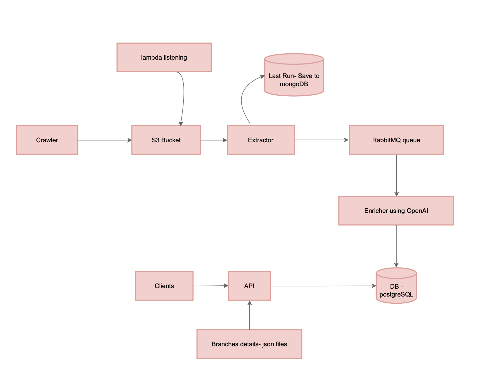

# 🛒 Salim Price Pipeline

A pipeline for collecting, normalizing, and enriching price and promotion files from supermarket chains.  
The system runs entirely in Docker and includes multiple services: **Crawler, S3 (LocalStack), Lambda, RabbitMQ, Consumer, PostgreSQL, API, and more.**

---

## 🚀 Start

### Environment Variables

Create a `.env` file under "salim" folder and add:

```
OPENAI_API_KEY=your_openai_key
```

### Start Services

```bash
docker compose up -d --build
```

---

## 📡 Services

- **api** – FastAPI 
- **db** – PostgreSQL  
- **pgadmin** – PostgreSQL management UI  
- **rabbitmq** – Message Queue 
- **mongo** – MongoDB for state (e.g., last run)  
- **localstack** – AWS S3 emulation

---

## 📋 API Endpoints

- **Swagger- FastAPI** – http://localhost:8000/docs  
- **RabbitMQ** – http://localhost:15672/ (username: app, password: app) 
- **pgAdmin** – http://localhost:5050/
### about pgAdmin

Web UI for managing PostgreSQL.

- **URL:** http://localhost:5050  
- **Username:** admin@admin.com  
- **Password:** admin

Steps to connect:

1. Log into pgAdmin.  
2. Right-click **Servers** → **Register → Server**.  
3. Fill in:

**General:**
```
Name: salimDB
```

**Connection:**
```
Host: db
Port: 5432
Database: salim_db
Username: postgres
Password: postgres
```

---

## 🕵️ Crawlers

To run the crawler you want:

```bash
docker compose exec api python -u crawlers/yohananof_crawler.py
docker compose exec api python -u crawlers/politzer_crawler.py
docker compose exec api python -u crawlers/carrefour_crawler.py
docker compose exec api python -u crawlers/keshet_crawler.py
docker compose exec api python -u crawlers/osherad_crawler.py
docker compose exec api python -u crawlers/tivtaam_crawler.py
```

---

## 🧠 Enrichment

- Enrichment is performed using `enrich.py`.  
- The `AIenricher_examples` folder contains example files enriched via the OpenAI API.  
- A fast fallback enrichment (non-AI) is available for development or testing.

---

## 🗄️ Databases

### PostgreSQL (psql)

Access the database with:

```bash
docker compose exec db psql -U postgres -d salim_db
```

---


---

## 📊 MongoDB – Last Run

To view the most recent saved run:

```bash
docker compose exec mongo mongosh prices --eval 'db.last_run.find().sort({updated_at:-1}).limit(1).pretty()'
```

---

## 🏗️ Architecture

The system architecture:



---

## 🐳 Docker Containers

| Service        | Description                         | Port(s)            |
|----------------|-------------------------------------|---------------------|
| api            | FastAPI app                         | 8000                |
| lambda         | Polls S3 every 10 seconds for new files   | 8080                |
| save-to-sql    | Saves enriched data to PostgreSQL   | —                   |
| pgadmin        | PostgreSQL API      | 5050 (mapped from 80)|
| rabbitmq       | Message queue with UI               | 5672 / UI: 15672     |
| mongo          | MongoDB for "last run" files          | 27017               |
| s3-simulator (localstack)    | Emulated AWS S3 (S3 simulator)      | 4566                |
| selenium       | Remote headless Chrome (Selenium)   | 4444                |
| db             | PostgreSQL database                 | 5440:5432           |

